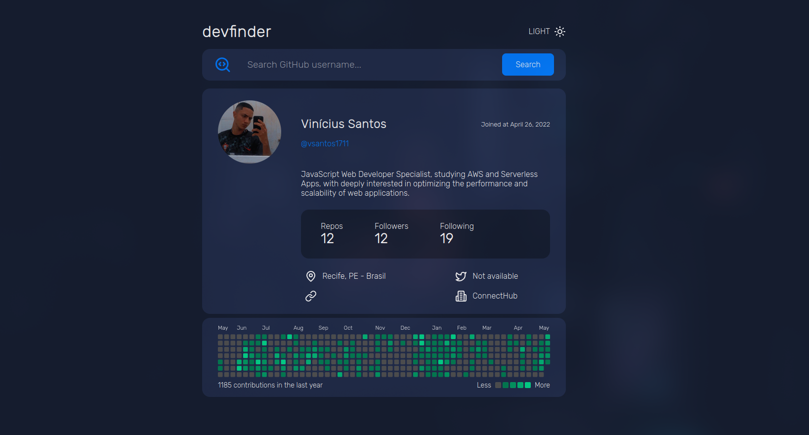

<h1 align="center">🔎 Dev Finder</h1>

<p align="center">
  <i align="center">A app how get dev infos from the github</i>
  
</p>

## Project Status


## Description

DevFinder: A simple app to explore detailed profiles of GitHub developers. Discover repositories, contributions, followers, and more. Perfect for recruiters and collaborators.

## Tools

[](https://react.dev/)
[](https://vitejs.dev/)
[](https://www.typescriptlang.org/)
[](https://styled-components.com/)

## Running the project

1. Clone the repository and install dependencies:

```shell
git clone https://github.com/vsantos1711/dev-finder.git && cd dev-finder &&
pnpm install
```

2. Run the app:

```shell
pnpm run dev
```

## Contributors

<a href="https://github.com/vsantos1711/countries/graphs/contributors">
  
</a>
